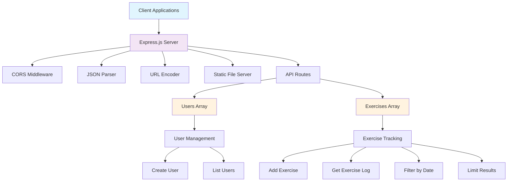
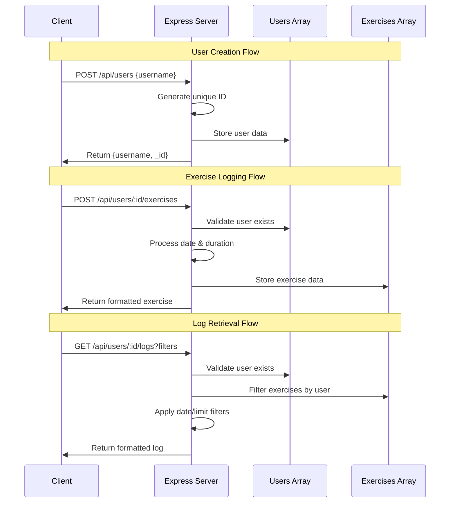
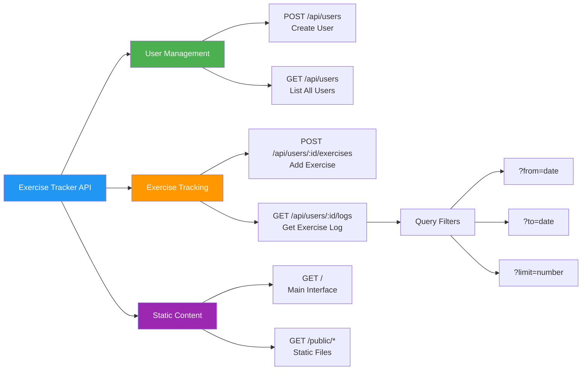

# Exercise Tracker API

## Overview

The Exercise Tracker API is a simple and reliable tool designed to help users keep track of their physical activities. It allows you to create profiles, log various exercises with details like duration and date, and view summaries of your workout history.

Whether you're an individual trying to maintain a healthy lifestyle or a business looking to offer fitness tracking capabilities, this API provides an easy and efficient way to manage exercise data.

---

## Key Benefits

- **User Management:** Easily create and manage individual user profiles.  
- **Exercise Logging:** Record exercise activities with descriptions, durations, and dates.  
- **Activity Summaries:** Retrieve detailed logs of exercises to monitor progress over time.  
- **Flexible Date Filters:** View exercise history for specific time periods to analyze patterns.  
- **Simple Date Format:** Dates are displayed in a clear, readable format (e.g., "Mon Jun 02 2025") for easy understanding.

---

## Who Can Use This?

- **Fitness Coaches & Trainers:** Track client workouts and progress effortlessly.  
- **Health & Wellness Apps:** Integrate exercise tracking into your platform without building from scratch.  
- **Individual Users:** Maintain a personal exercise diary to stay motivated and healthy.  
- **Businesses:** Offer value-added services with a simple fitness tracking backend.

---

## How It Works

1. **Create a User Profile:** Set up a new account with a unique username.  
2. **Log Exercises:** Add details about your workouts, including what you did, how long, and when.  
3. **Review Your Activity:** Access your exercise history anytime, filtered by dates or limited to recent entries.

All dates are shown in an easy-to-read style to keep your records clear and straightforward.

---

## Why Choose This API?

- **Ease of Use:** Designed for straightforward integration and simple operation.  
- **Accurate Tracking:** Supports detailed exercise records with reliable date handling.  
- **Flexible Reporting:** Enables tailored views of your activity data to support your fitness goals.

---

## Getting Started

You don't need to worry about complicated setups or technical details. The API is ready to help you or your users start tracking exercises quickly and effectively.

---

## Summary

Exercise Tracker API is the perfect solution to keep fitness data organized, accessible, and meaningful, whether you're an individual, trainer, or business. Stay motivated, analyze your workouts, and reach your health goals with confidence.

---

# Technical Documentation

## Software Architecture Overview

The Exercise Tracker API is built with a simple and efficient architecture focused on reliability and ease of maintenance:

- **Express.js Framework:** Handles HTTP requests, routing, and middleware management
- **In-Memory Database:** Stores user profiles and exercise records in JavaScript arrays for fast access *(Note: suitable for development and testing; a persistent database is recommended for production)*
- **RESTful Design:** Clean API endpoints following REST conventions for predictable interactions
- **CORS Enabled:** Cross-origin resource sharing configured for web browser compatibility
- **JSON Communication:** All data exchange uses JSON format for easy integration
- **Unique ID Generation:** Uses timestamp and random string combination for user identification

### System Architecture Diagram



### Data Flow Diagram



### Key Architecture Decisions

- **Memory Storage:** Uses JavaScript arrays (`users[]` and `exercises[]`) for data persistence during runtime
- **Stateless Design:** Each request is independent, enabling easy horizontal scaling
- **Date Handling:** Flexible date input with automatic formatting to readable date strings
- **Error Handling:** Proper HTTP status codes and error messages for robust client integration

## API Endpoint Overview



## API Documentation

### 1. Create New User

**Endpoint:**  
`POST /api/users`

**Request Body:**
```json
{
  "username": "john_doe"
}
```

**Behavior:**
- Creates a new user profile with unique ID
- Generates ID using timestamp and random string combination
- Stores user in memory for the session

**Response:**
```json
{
  "username": "john_doe",
  "_id": "lz7x8y9z2a3b"
}
```

### 2. Get All Users

**Endpoint:**  
`GET /api/users`

**Response:**
```json
[
  {
    "username": "john_doe",
    "_id": "lz7x8y9z2a3b"
  },
  {
    "username": "jane_smith",
    "_id": "m1n2o3p4q5r6"
  }
]
```

### 3. Add Exercise for User

**Endpoint:**  
`POST /api/users/:_id/exercises`

**Parameters:**
- `_id` (string) — User's unique identifier

**Request Body:**
```json
{
  "description": "Running",
  "duration": 30,
  "date": "2025-06-02"
}
```

**Request Fields:**
- `description` (string, required) — Description of the exercise activity
- `duration` (number, required) — Duration in minutes
- `date` (string, optional) — Date in YYYY-MM-DD format (defaults to current date)

**Behavior:**
- Validates user existence
- Converts duration to integer
- Uses current date if no date provided
- Stores exercise linked to user ID

**Response:**
```json
{
  "_id": "lz7x8y9z2a3b",
  "username": "john_doe",
  "description": "Running",
  "duration": 30,
  "date": "Mon Jun 02 2025"
}
```

**Error Response:**
```json
{ "error": "User not found" }
```

### 4. Get User Exercise Log

**Endpoint:**  
`GET /api/users/:_id/logs`

**Parameters:**
- `_id` (string) — User's unique identifier

**Query Parameters (Optional):**
- `from` (string) — Start date filter (YYYY-MM-DD format)
- `to` (string) — End date filter (YYYY-MM-DD format)  
- `limit` (number) — Maximum number of exercises to return

**Examples:**
```
GET /api/users/lz7x8y9z2a3b/logs
GET /api/users/lz7x8y9z2a3b/logs?from=2025-01-01&to=2025-12-31
GET /api/users/lz7x8y9z2a3b/logs?limit=10
GET /api/users/lz7x8y9z2a3b/logs?from=2025-06-01&limit=5
```

**Behavior:**
- Validates user existence
- Filters exercises by date range if specified
- Limits results if limit parameter provided
- Returns exercises in chronological order

**Response:**
```json
{
  "username": "john_doe",
  "count": 2,
  "_id": "lz7x8y9z2a3b",
  "log": [
    {
      "description": "Running",
      "duration": 30,
      "date": "Mon Jun 02 2025"
    },
    {
      "description": "Cycling",
      "duration": 45,
      "date": "Tue Jun 03 2025"
    }
  ]
}
```

**Error Response:**
```json
{ "error": "User not found" }
```

### 5. Application Root

**Endpoint:**  
`GET /`

**Response:**  
Serves the main HTML interface from `/views/index.html`

### 6. Static Assets

**Endpoint:**  
`GET /public/*`

**Behavior:**  
Serves static files from the `/public` directory

## Data Models

### User Object
```javascript
{
  username: String,    // User's chosen username
  _id: String         // Unique identifier (timestamp + random)
}
```

### Exercise Object (Internal Storage)
```javascript
{
  _id: String,        // User ID this exercise belongs to
  username: String,   // Username for quick reference
  description: String, // Exercise description
  duration: Number,   // Duration in minutes
  date: String        // Date in YYYY-MM-DD format
}
```

### Exercise Response Object
```javascript
{
  description: String, // Exercise description
  duration: Number,   // Duration in minutes  
  date: String        // Formatted date string (e.g., "Mon Jun 02 2025")
}
```

## Environment Configuration

The application uses environment variables for configuration:

- `PORT` (optional): Server port number (defaults to 3000)

## Installation & Setup

1. **Install Dependencies:**
   ```bash
   npm install express cors dotenv
   ```

2. **Environment Setup:**
   Create a `.env` file (optional):
   ```
   PORT=3000
   ```

3. **Run the Application:**
   ```bash
   node server.js
   ```

## Usage Examples

### Creating a User and Adding Exercises

```bash
# Create a new user
curl -X POST http://localhost:3000/api/users \
  -H "Content-Type: application/json" \
  -d '{"username": "fitness_enthusiast"}'

# Add an exercise (using the returned _id)
curl -X POST http://localhost:3000/api/users/lz7x8y9z2a3b/exercises \
  -H "Content-Type: application/json" \
  -d '{"description": "Push-ups", "duration": 15, "date": "2025-06-02"}'

# Get exercise log
curl http://localhost:3000/api/users/lz7x8y9z2a3b/logs
```

### JavaScript Integration

```javascript
// Create user
const createUser = async (username) => {
  const response = await fetch('/api/users', {
    method: 'POST',
    headers: { 'Content-Type': 'application/json' },
    body: JSON.stringify({ username })
  });
  return response.json();
};

// Add exercise
const addExercise = async (userId, exercise) => {
  const response = await fetch(`/api/users/${userId}/exercises`, {
    method: 'POST',
    headers: { 'Content-Type': 'application/json' },
    body: JSON.stringify(exercise)
  });
  return response.json();
};

// Get exercise log
const getExerciseLog = async (userId, filters = {}) => {
  const params = new URLSearchParams(filters);
  const response = await fetch(`/api/users/${userId}/logs?${params}`);
  return response.json();
};
```

## Production Considerations

- **Database Integration:** Replace in-memory arrays with a persistent database (MongoDB, PostgreSQL, etc.)
- **Input Validation:** Add comprehensive validation for all inputs
- **Authentication:** Implement user authentication and authorization
- **Rate Limiting:** Add rate limiting to prevent abuse
- **Error Logging:** Implement proper logging for monitoring and debugging
- **Data Backup:** Ensure regular backups of exercise data
- **Scaling:** Consider database indexing and caching for better performance

## Security Notes

- **Input Sanitization:** Always validate and sanitize user inputs
- **ID Generation:** Current ID generation is sufficient for development but consider UUIDs for production
- **Data Privacy:** Implement proper data protection measures for user information
- **CORS Configuration:** Adjust CORS settings for production environment

---

*Last updated: June 2, 2025*